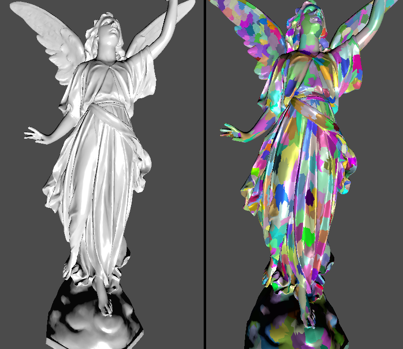
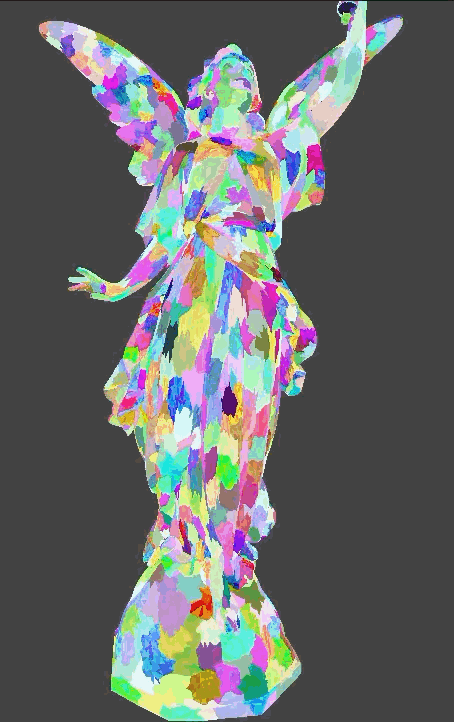

# Modern Vulkan Renderer
Renders millions of meshes in a single draw call. 

These are not required to be the same meshes like with instanced drawing.
This is achieved by generating the draw command data inside a compute shader, i.e. the data of which mesh is drawn and how many draws in total should be executed. (The command vkCmdDrawMeshTasksIndirectCountEXT is used here.)
The output is then used by task and mesh shaders to generate the actual triangle data for the rasterizer and fragment shader.

Using task and mesh shaders requires that the mesh data needs to be preprocessed. In particular each mesh needs to be divided into meshlets, small groups of locally close triangles. This is due to a hardware limitation of mesh shaders, which cannot by themselves process millions of vertices. 

To not waste time processing triangles that will not be visible:
    - The compute shader culls meshes that completely fall outside of the camera's view frustum by not generating draw command data for such meshes.
    - The task shader culls meshlets where all triangles face away from the camera. This avoids running back face culling on all triangles in a meshlet. Any meshlet which could be at least partially visible is still culled by the rasterizer.
  

The buffers used by the meshlet pipeline are not bound via descriptors. 
Instead the buffer's gpu address is passed to the shaders with a single push constant. 
The shaders then just index and dereference the values as needed. 
This simplifies the pipeline code. 
The cpu now just needs to allocate the push constant data inside memory visible to both cpu and gpu, fill in the data and the pointers for this frame and pass a single pointer to the push constant to all shaders of a pipeline.

It originally followed [How to Vulkan in 2026](https://www.howtovulkan.com/) and also took inspiration from the [niagara project](https://youtube.com/playlist?list=PL0JVLUVCkk-l7CWCn3-cdftR0oajugYvd&si=OShHwX8FKuxmsHJe) by Arseny Kapoulkine aka. Zeux.

## Further Details

### Meshlets
Meshes are subdivided into meshlets: smaller groups of triangles of the mesh
  
Here each group is visualized with a different color.

### Level of Detail
Multiple levels of detail are generated per mesh. The decision of which LOD to use can be based on the distance to the camera.

  
The further the camera is from the mesh, the fewer meshlets and therefore triangles are used to draw it. The reduces the work for the gpu. The distances should be tuned, so that the visual impact of switching to a lower level of detail is minimal.

## Dependencies

The dependencies are not committed into this repository. You can find them through these links:
- [Odin Bindings for Meshoptimizer](https://github.com/GloriousPtr/odin-meshoptimizer): used to generate the meshlets and LOD data from the mesh. (Note: these are bindings to the original library, which has a C api.)